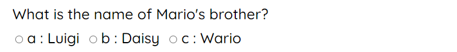
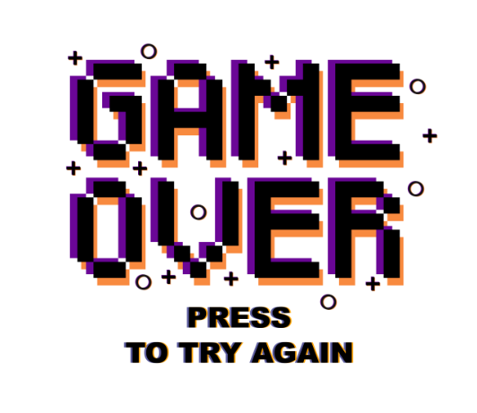
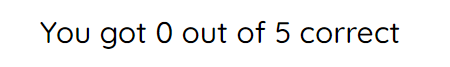
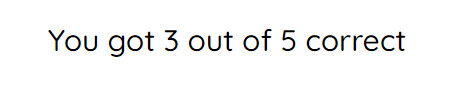

# Video Game Quiz Project

[View the live website here](https://gar-16.github.io/Quiz-Project/)

When trying to think of what to code for my second project, I was quiet stumped. I found JavaScript to be quiet difficult so I decided to keep my project as simple as possible. So I went for the idea of making a simple quix and combining it with one of my interests, video games. The quiz is based off some simple classic video game knowledge that is hopefully quiet general so as a broader audience can enjoy it. The quiz takes the answers to the questions provided and gives back a results screen that depends on how many questions were answered correctly.

## Features

### Existing Features

- __Questions with Radio Buttons__
  - Upon entering the quiz, the questions are visable immediatly with mulitple choice answers underneath.

- __Submit Answers Button__
  - After selecting all answers to the questions, the user then can click the "Get Results" button to see how they did.

- __Game Over Screen__
  - Once the user has submitted their answer, if the user did not get all answers correct they will get a game over screen. This image can be clicked to start again.

- __Results__
  - After the answers are submited, the results of the quiz will be shown and will be different depending on how many were correct.

