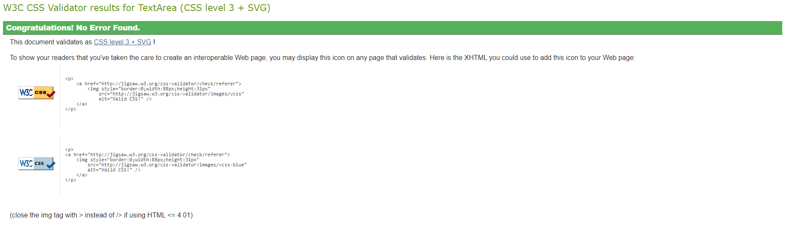
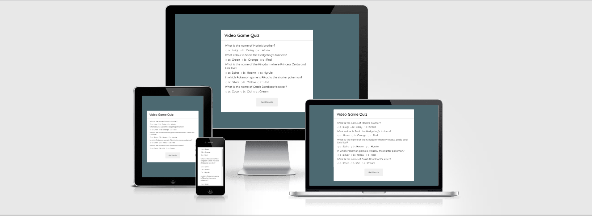

# Video Game Quiz Project

[View the live website here](https://gar-16.github.io/Quiz-Project/)

When trying to think of what to code for my second project, I was quiet stumped. I found JavaScript to be quiet difficult so I decided to keep my project as simple as possible. So I went for the idea of making a simple quix and combining it with one of my interests, video games. The quiz is based off some simple classic video game knowledge that is hopefully quiet general so as a broader audience can enjoy it. The quiz takes the answers to the questions provided and gives back a results screen that depends on how many questions were answered correctly.

## Features

### Existing Features

- __Questions with Radio Buttons__
  - Upon entering the quiz, the questions are visable immediatly with mulitple choice answers underneath.

- __Submit Answers Button__
  - After selecting all answers to the questions, the user then can click the "Get Results" button to see how they did.

- __Game Over Screen__
  - Once the user has submitted their answer, if the user did not get all answers correct they will get a game over screen. This image can be clicked to start again.

- __Results__
  - After the answers are submited, the results of the quiz will be shown and will be different depending on how many were correct.

## Testing

### Validator Testing

- HTML
  - No errors were returned when passing through the official W3C validator

- CSS
  - No errors were returned when passing through the official Jigsaw validator

### Lighthouse Testing

### Bugs

- Encountered a bug with the responsivness of of the site when viewed on mobile. Unfortunitley had great difficulty with fixing this and was unable to find the solution. 

- Encountered a bug while coding JavaScript where it would not accept "answers, eventually figured out that I was missing a comma after the questions string

### Browser Compatibility

- Site was built and works with Google Chrome

- Site has been test and works with Microsoft Edge
  
- Site has been test and works with Firefox
  
- Site has been test and works with Opera

# Deployment

- The site was deployed to GitHub pages. The steps to deploy are as follows:
  - In the GitHub repository, navigate to the Settings tab
  
  - From the source section drop-down menu, select the Master Branch
  
  - Once the master branch has been selected, the page will be automatically refreshed with a detailed ribbon display to indicate the successful deployment.

The live link can be found here: <https://gar-16.github.io/Quiz-Project/>

# Credits

## Content

Some code for the quiz was taken from <https://simplestepscode.com/javascript-quiz-tutorial/>

Some JavaScript was taken from <https://www.sitepoint.com/simple-javascript-quiz/>

## Media

Mario image is taken from [Imgbin](<https://imgbin.com/>)

Game over image taken from [Pngimages](<https://www.pngimages.in/>) 